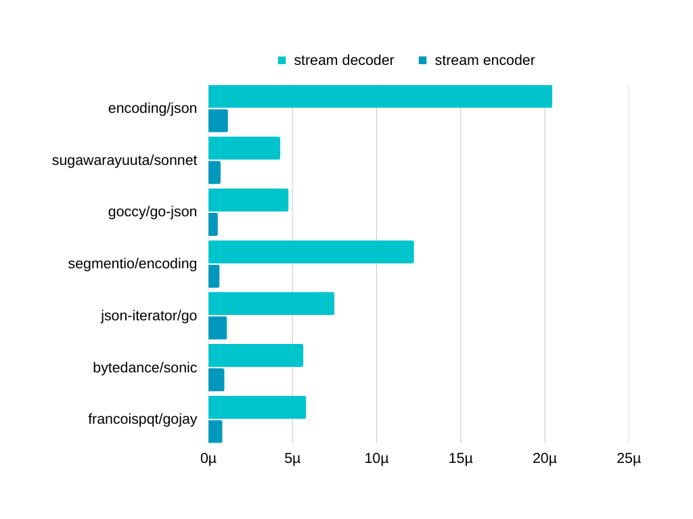
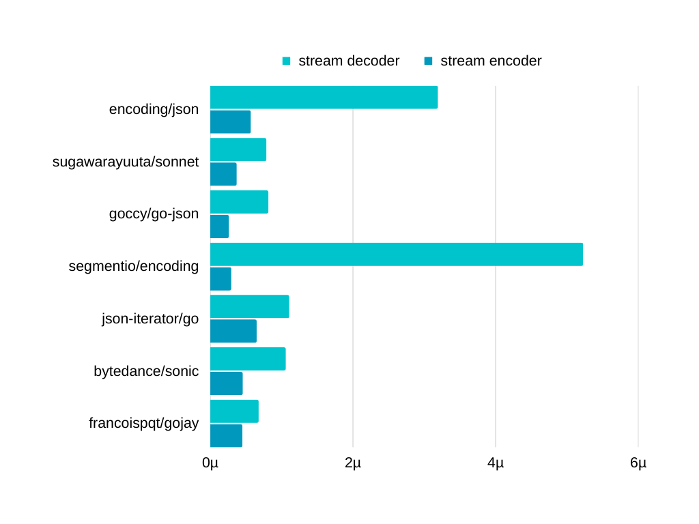
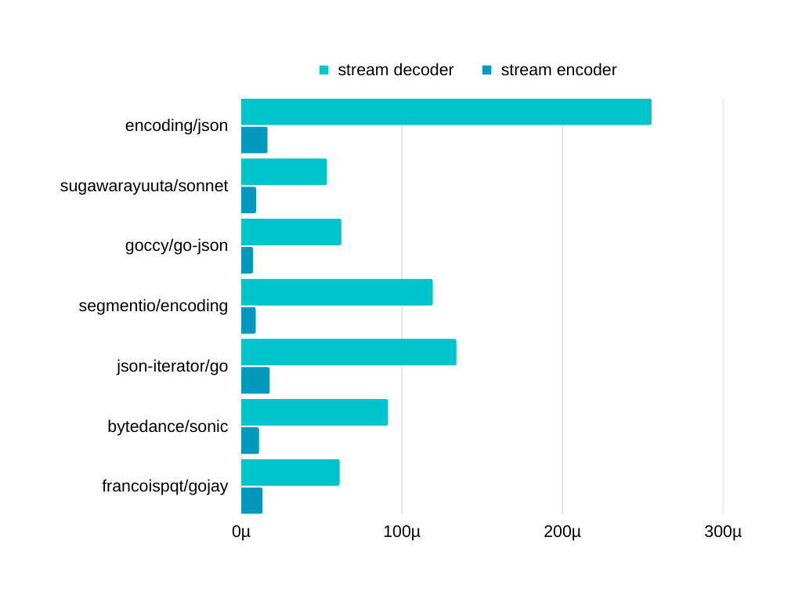

## Sonnet


High performance JSON decoder in Go

### Features

- 100% compatible with the Go standard library.

- Efficient. uses less memory and roughly 5 times faster than the standard library when decoding JSON.

- Decent streaming (io.Reader) support. 

### Motivation

- Why another JSON decoder?

I was amazed at the number of JSON packages, but I guess i was more surprised when I realized the problems they had. I'll mention that in the next section. In short... they were incompatible, and slow. That's when I decided to create this.

### Problems we had

- CPU dependent

Use of assembly; drops support for things like M1/raspberry pi, since they have different architectures

- Not user friendly

Complicated and (or) Incompatible APIs - making the migration difficult.

- Preparation

A switch-case needs to be written by the user, or a static code generation needs to be used.

- Not actively maintained

Newer versions are often unsupported. they sometimes have EOL packages as dependencies

- Not so fast at the end

Lots of reflections, poor streaming (io.Reader) features

### Installation

```
go get github.com/sugawarayuuta/sonnet
```

### Usage

The usage is the same as the standard library.

Use [pkg.go.dev](https://pkg.go.dev/encoding/json) website, or read [the blog post](https://go.dev/blog/json)

### Benchmarks 

- https://pkg.go.dev/encoding/json

- https://pkg.go.dev/github.com/goccy/go-json

- https://pkg.go.dev/github.com/json-iterator/go

- https://pkg.go.dev/github.com/segmentio/encoding/json

- https://pkg.go.dev/github.com/bytedance/sonic

- https://pkg.go.dev/github.com/francoispqt/gojay

| [Medium Payload](https://github.com/goccy/go-json/blob/master/benchmarks/medium_payload.go#L6) |
| :---: |
|  | 

| [Large Payload](https://github.com/goccy/go-json/blob/master/benchmarks/large_payload.go#L153) | [Small Payload](https://github.com/goccy/go-json/blob/master/benchmarks/small_payload.go#L5) |
| :---: | :---: |
|  |  |

### Thanks

- The reader in this package is inspired by [pkg/json](https://github.com/pkg/json)

- [Article written by goccy](https://engineering.mercari.com/blog/entry/1599563768-081104c850/), the author of goccy/go-json (in Japanese). useful and above all interesting.