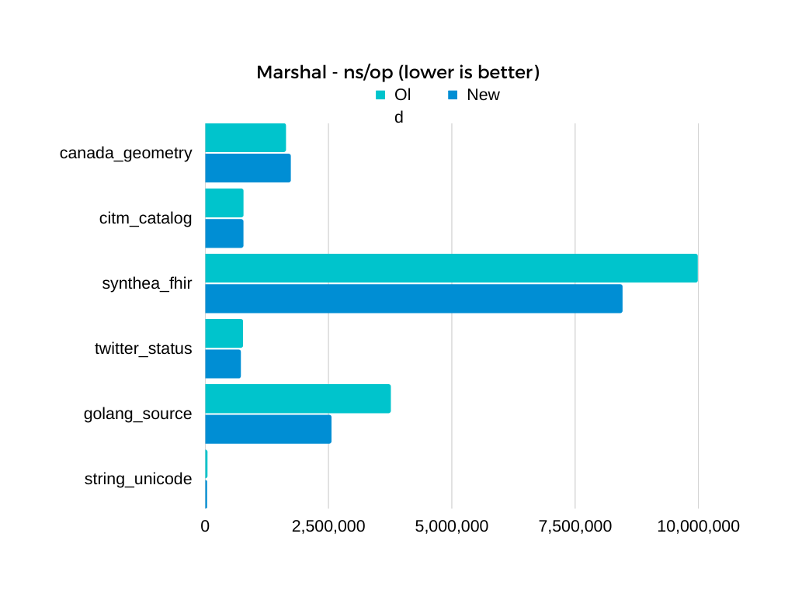
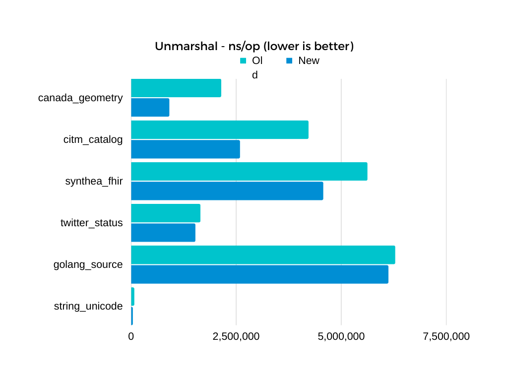

## Sonnet

High performance JSON library in Go.


### Features

- Fully compatible with the Go standard library, Both the encoder and the decoder passed all tests from it.

- Efficient. Uses less memory and several times shorter decoding time when I benchmark this against the standard library.

- "encoding/json" independent. Unlike some of other implementations, It doesn't call the standard library's JSON, at all. it's written from ground up.

### The problems of others

Some are CPU dependent, some libraries' APIs are incompatible, most of them use unsafe, some requires static code generation, etc.

But that's not all. even with these downsides, they're still slow.

### Installation

```
go get github.com/sugawarayuuta/sonnet
```

### Usage

The usage is the same as the standard library.

Use [pkg.go.dev](https://pkg.go.dev/encoding/json) website, or read [the blog post](https://go.dev/blog/json)

### Performance differences after the removal of unsafe

After some effort, it's actually faster than the previous one. See the below benchmarks for more information.

| Marshal | Unmarshal |
| :---: | :---: |
|  |  |

### Benchmarks

Although I recommend you to benchmark this yourself, [here](https://github.com/sugawarayuuta/benchmark) is benchmarks on my machine for reference. (currently, it's showing the old version. It'll be updated to the latest version of this, soon)

In short, At least in my environment, I couldn't find a faster library that is implemented "correctly". "correct", as in, proper UTF8 handling, validation of RawMessage, and others. Which some of the alternatives don't do.


### Thank you

- the icon above is from [ashleymcnamara/gophers](https://github.com/ashleymcnamara/gophers), Thank you!

- Daniel Lemire's work (several) [simdjson](https://github.com/simdjson/simdjson), [fast_double_parser](https://github.com/lemire/fast_double_parser), etc.