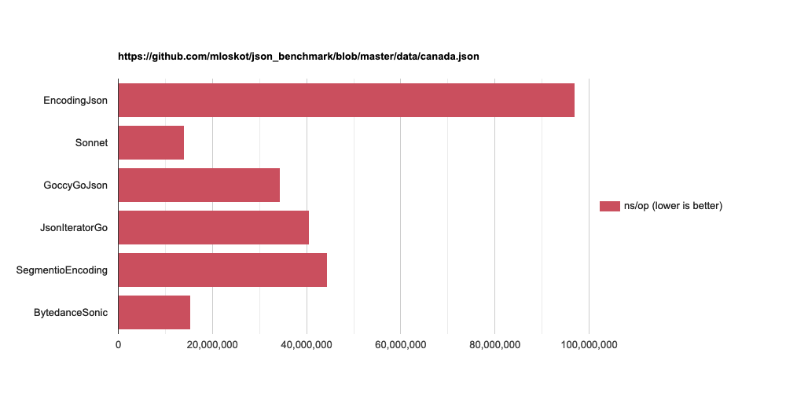
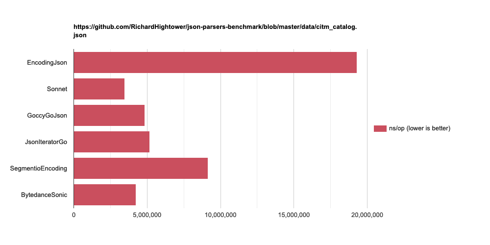

## Sonnet

High performance JSON decoder in Go

### Features

- Almost 100% compatible with the Go standard library's decoder.

- Efficient. uses less memory and roughly 5 times faster than the standard library when decoding JSON. (currently the fastest, see benchmarks below.)

- Decent streaming (io.Reader) support. 

### Motivation

- Why another JSON decoder?

I was amazed at the number of JSON packages, but I guess i was more surprised when I realized the problems they had. I'll mention that in the next section. In short... they were incompatible, and slow. That's when I decided to create this.

- Why is this only a decoder?

When it comes to compatibility and speed, it was difficult to implement an standard library like encoder which has things like key sorting and HTML escaping by default.

### Problems we had

- CPU dependent

Use of assembly; drops support for things like M1/raspberry pi, since they have different architectures

- Not user friendly

Complicated and (or) Incompatible APIs - making the migration difficult.

- Preparation

A switch-case needs to be written by the user, or a static code generation needs to be used.

- Not actively maintained

Newer versions are often unsupported. they sometimes have EOL packages as dependencies

- Not so fast at the end

Lots of reflections, poor streaming (io.Reader) features

### Installation

```
go get github.com/sugawarayuuta/sonnet
```

### Usage

The usage is the same as the standard library.

Use [pkg.go.dev](https://pkg.go.dev/encoding/json) website, or read [the blog post](https://go.dev/blog/json)

### Benchmarks 

- EncodingJson - https://pkg.go.dev/encoding/json

- GoccyGoJson - https://pkg.go.dev/github.com/goccy/go-json

- JsonIteratorGo - https://pkg.go.dev/github.com/json-iterator/go

- SegmentioEncoding - https://pkg.go.dev/github.com/segmentio/encoding/json

- BytedanceSonic - https://pkg.go.dev/github.com/bytedance/sonic



```
https://github.com/mloskot/json_benchmark/blob/master/data/canada.json

BenchmarkEncodingJson-4               12          96964963 ns/op        27765290 B/op     228528 allocs/op
BenchmarkSonnet-4                     79          13940859 ns/op         4797525 B/op      57727 allocs/op
BenchmarkGoccyGoJson-4                31          34442790 ns/op        21336496 B/op     223244 allocs/op
BenchmarkJsonIteratorGo-4             26          40635643 ns/op        12176595 B/op     331657 allocs/op
BenchmarkSegmentioEncoding-4          25          44328402 ns/op        25105469 B/op      57049 allocs/op
BenchmarkBytedanceSonic-4             74          15283698 ns/op        18985535 B/op      56707 allocs/op
```



```
https://github.com/RichardHightower/json-parsers-benchmark/blob/master/data/citm_catalog.json

BenchmarkEncodingJson-4               56          19289518 ns/op         5850983 B/op      33049 allocs/op
BenchmarkSonnet-4                    313           3477650 ns/op          905760 B/op       5469 allocs/op
BenchmarkGoccyGoJson-4               247           4855301 ns/op         2989978 B/op      14323 allocs/op
BenchmarkJsonIteratorGo-4            225           5163313 ns/op         1339385 B/op      34599 allocs/op
BenchmarkSegmentioEncoding-4         130           9156341 ns/op         5129332 B/op       3303 allocs/op
BenchmarkBytedanceSonic-4            274           4235117 ns/op         3848331 B/op      10505 allocs/op
```

### Issues

- [json.Unmarshaler](https://pkg.go.dev/encoding/json#Unmarshaler) is not supported. this will be implemented in the future release.

- [json.RawMessage](https://pkg.go.dev/encoding/json#RawMessage) is not supported. this will be implemented in the future release.

### Thanks

- The reader and the scanner in this package is inspired by [pkg/json](https://github.com/pkg/json)

- [Article written by goccy](https://engineering.mercari.com/blog/entry/1599563768-081104c850/), the author of goccy/go-json (in Japanese). useful and above all interesting.